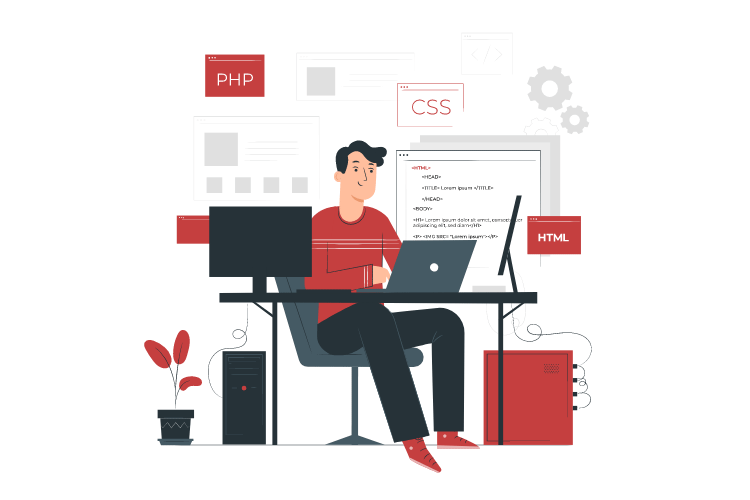

<h1 align="center">Hi there, I'm SHIVANK VARSHNEY 👋</h1>
<h3 align="center">Experienced Frontend Web Developer with a demonstrated history of working in the computer software industry. Skilled in designing webistes and application in React or React Native.</h3>

  

---

### Connect with me:

 
 

---

### Languages and Tools :

 
 

---